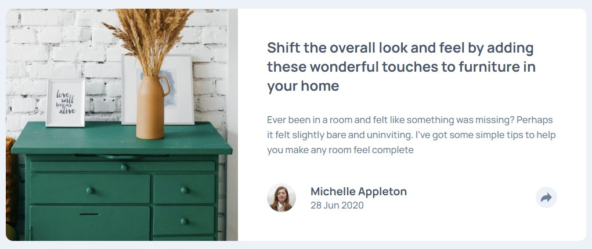

# Frontend Mentor - Article Preview Component

This is a solution to the [Article preview component challenge on Frontend Mentor](https://www.frontendmentor.io/challenges/article-preview-component-dYBN_pYFT). 
## Table of contents

- [Overview](#overview)
  - [Screenshot](#screenshot)
  - [Links](#links)
- [My process](#my-process)
  - [Built with](#built-with)
  - [What I learned](#what-i-learned)
- [Author](#author)

## Overview

### Screenshot

### Links

- Solution URL: [Github](https://github.com/Muhammad-Taus/Front-End-Mentor-Article-Preview-Component/)
- Live Site URL: [Live site URL](https://mt-fem-article-preview-component.netlify.app/)

## My process

### Built with

- Semantic HTML5 markup
- CSS custom properties
- Flexbox
- Mobile-first workflow
- Media Queries

### What I learned

I practiced my CSS skills after quite a long time.

## Author

- Frontend Mentor - [@Muhammad-Taus](https://www.frontendmentor.io/profile/Muhammad-Taus)
